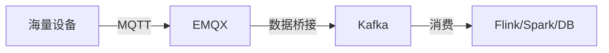

Kafka 和 EMQX 虽然都是“消息中间件”，都支持发布/订阅模式，但它们的**设计基因、核心用途和解决的问题**完全不同。

简单来说：**EMQX 是为了“连接设备”而生（物联网接入），Kafka 是为了“搬运数据”而生（大数据管道）。**

以下是详细的对比分析：

### 📊 核心区别概览表

| 维度 | **EMQX** | **Kafka** |
| :--- | :--- | :--- |
| **核心定位** | **物联网消息接入平台** | **分布式流处理平台 / 日志管道** |
| **主要协议** | **MQTT** (标准协议，设备首选) | **Kafka Protocol** (自定义 TCP，客户端专用) |
| **通信模式** | **双向通信** (设备 <-> 云端) | **单向流动** (生产者 -> 消费者) |
| **连接能力** | **极强** (支持百万级长连接) | **弱** (不适合处理海量设备连接) |
| **数据存储** | **不存储** (消息即发即走，除非开启桥接) | **持久化存储** (消息存磁盘，可回溯) |
| **实时性** | **毫秒级** (指令下发、实时控制) | **秒级/毫秒级** (侧重吞吐量，有微小延迟) |
| **适用场景** | 设备接入、指令下发、即时通讯 | 日志收集、大数据ETL、削峰填谷 |

---

### 🧐 深度解析

#### 1. 协议与连接：MQTT vs 自定义 TCP
*   **EMQX (MQTT)**：
    *   它是为**弱网环境**设计的。设备（如传感器、手机）网络不稳定，MQTT 协议非常轻量，且支持心跳检测和断线重连。
    *   **长连接管理**：EMQX 擅长维持数百万个 TCP 长连接，并且资源占用极低。
*   **Kafka (Kafka Protocol)**：
    *   它是为**数据中心内部**设计的。它要求网络连接非常稳定。
    *   **连接开销**：Kafka 的连接（Producer/Consumer）相对较重。如果你让 10 万个设备直接连 Kafka，Kafka 的句柄和内存会瞬间爆炸，性能急剧下降。

#### 2. 消息流向：双向互动 vs 单向管道
*   **EMQX (双向)**：
    *   **上行**：设备发数据给服务器。
    *   **下行**：服务器发指令给设备（例如：“打开空调”）。这是 EMQX 的强项，通过主题（Topic）可以瞬间把指令推送到指定设备。
*   **Kafka (单向)**：
    *   Kafka 是一个**“黑盒管道”**。Producer 把数据扔进去，Consumer 拿出来处理。
    *   Kafka **不支持**主动向某个特定的 Producer 推送消息（没有“指令下发”的概念）。如果你想控制设备，Kafka 做不到。

#### 3. 数据存储：内存 vs 磁盘
*   **EMQX**：
    *   主要关注**实时性**。消息到了就转发，转发完就丢弃（除非配置了持久化桥接）。它更像是一个“路由器”。
*   **Kafka**：
    *   主要关注**可靠性与回溯**。消息会被**持久化到磁盘**。即使消费者挂了，重启后依然可以从 Kafka 中把历史数据拉出来重新处理。它更像是一个“硬盘”。

---

### 🤝 为什么它们是“黄金搭档”？

在你的架构中，它们不是竞争关系，而是**上下游关系**。

**最佳实践架构：**

1.  **EMQX 负责“接入”**：
    *   处理海量设备的连接、鉴权、心跳。
    *   处理设备上下线事件。
    *   接收设备上报的实时数据。
2.  **Kafka 负责“缓冲与分发”**：
    *   EMQX 收到数据后，通过**规则引擎**或**数据桥接**，将数据快速写入 Kafka。
    *   Kafka 负责把数据“存下来”，并分发给后端的各种大数据组件（如 Flink 做实时计算，Hadoop 做离线分析）。

### 📌 总结

*   **什么时候用 EMQX？**
    *   当你有**设备**（传感器、手机、车机）需要连接进来时。
    *   当你需要**双向通信**（既要收数据，又要发指令）时。
    *   当你使用 **MQTT 协议**时。

*   **什么时候用 Kafka？**
    *   当你需要处理**海量数据流**（日志、交易记录、IoT 历史数据）时。
    *   当你需要**削峰填谷**（后端处理慢，先存起来慢慢处理）时。
    *   当你需要**数据回溯**（重放过去一小时的数据）时。

**结论**：在你的系统中，**EMQX 是“前台”**，负责接待设备；**Kafka 是“后台”**，负责处理数据。两者缺一不可。